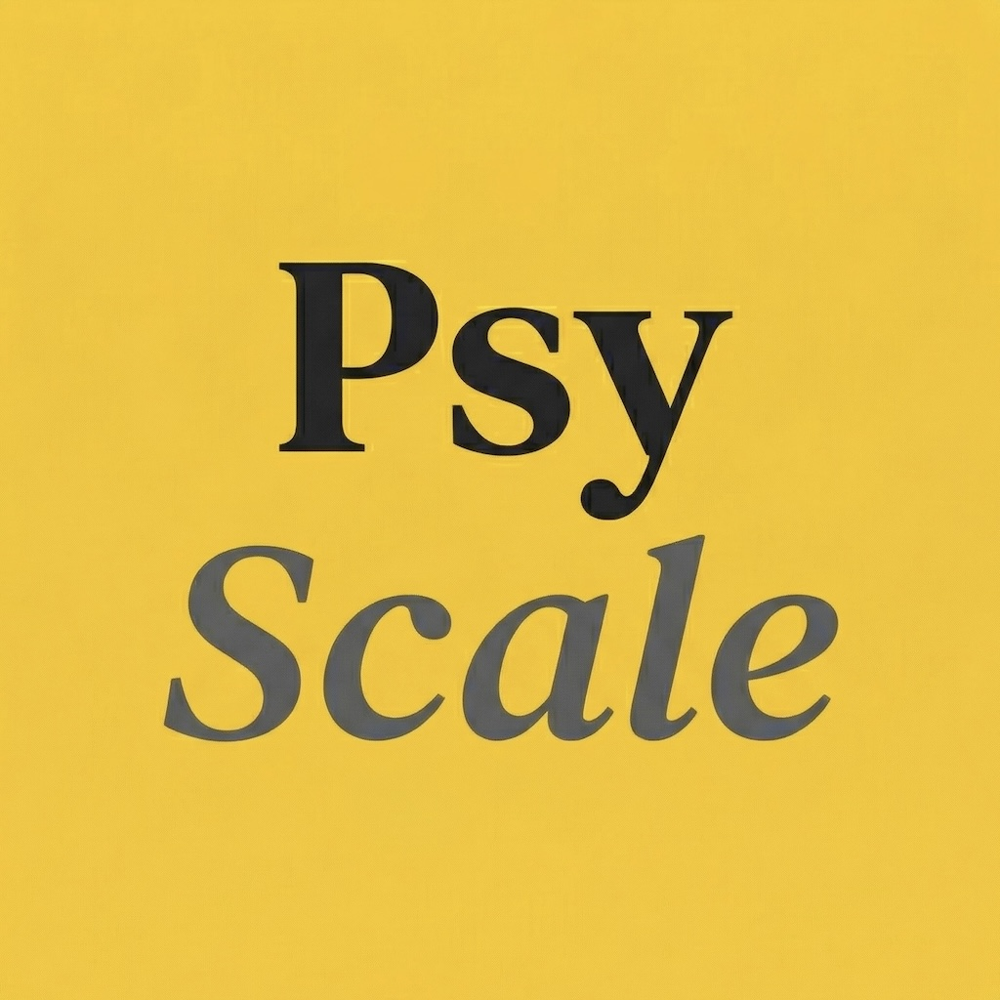
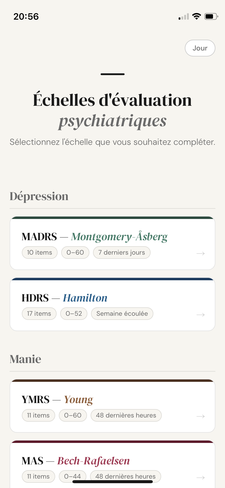
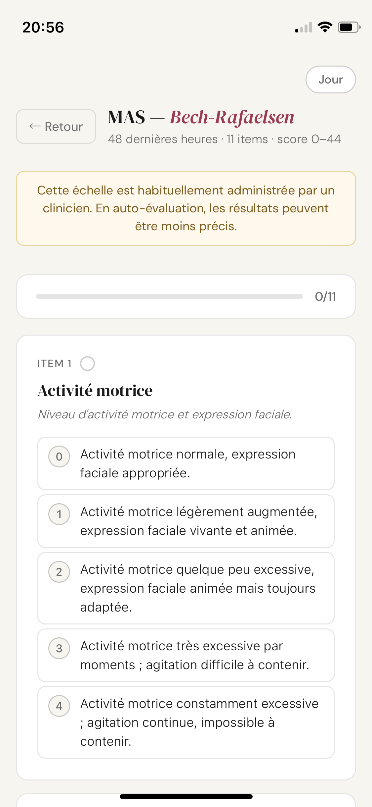
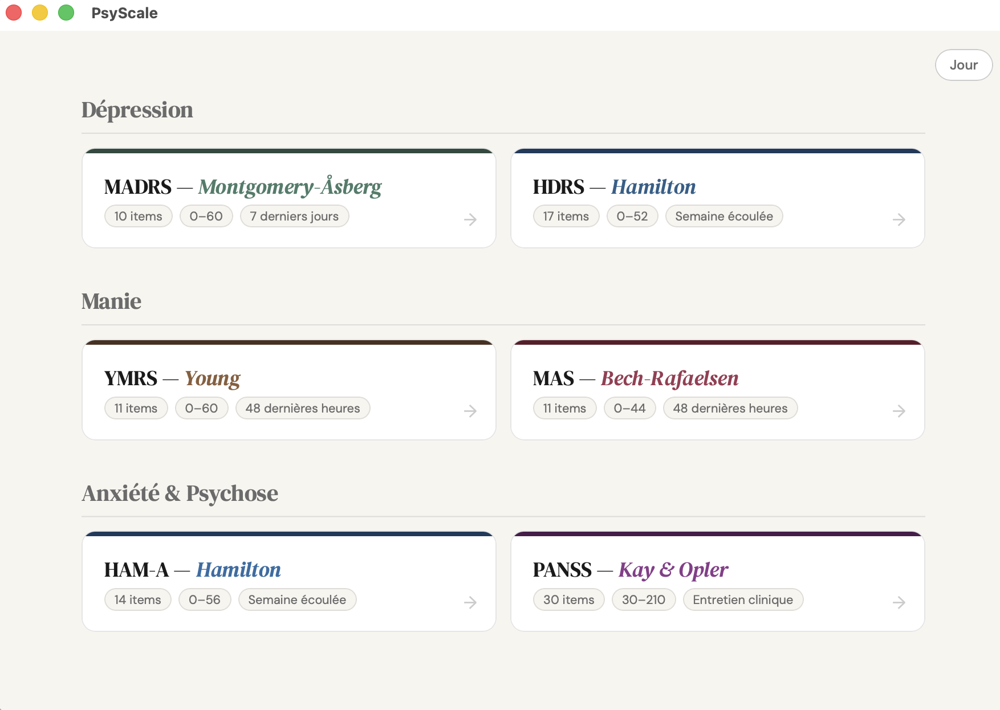
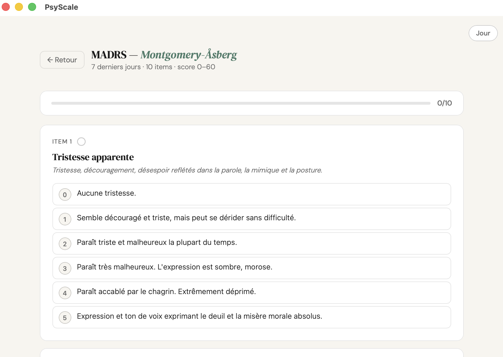

# PsyScale

🇬🇧 This application is a scoring assistance tool designed for healthcare professionals. It simplifies the rating process for validated clinical scales used in psychiatry.

🇫🇷 Cette application est un outil d'aide au calcul destiné aux professionnels de santé. Elle permet de simplifier la cotation des échelles cliniques validées utilisées en psychiatrie.

## 📱 Aperçu / Screenshots

  
  

  

  

## ✨ Soutenir le projet / Support the project

🇫🇷 PsyScale est un projet bénévole et gratuit. Si vous trouvez cet outil utile, vous pouvez verser une **contribution libre** pour soutenir sa maintenance et les frais de l'App Store (99€/an).
👉 **[Lien de Contribution](TON_LIEN_TALLY_OU_STRIPE_ICI)**

🇬🇧 PsyScale is a free, non-profit project. If you find this tool useful, you can make a **voluntary contribution** to support its maintenance and App Store fees ($99/year).
👉 **[Contribution Link](TON_LIEN_TALLY_OU_STRIPE_ICI)**

---

© 2026 Liminal Pictures

